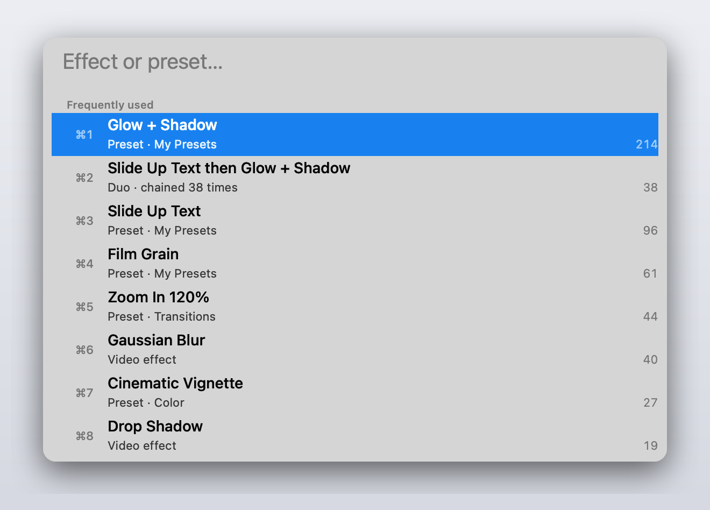
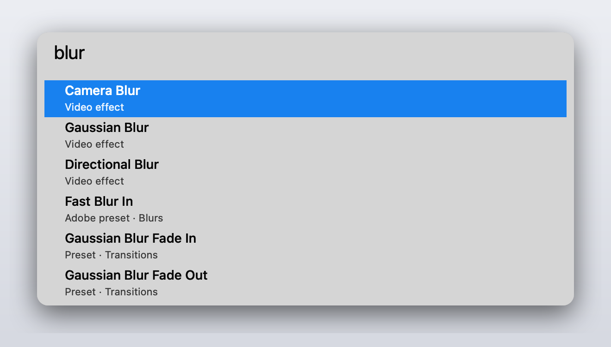
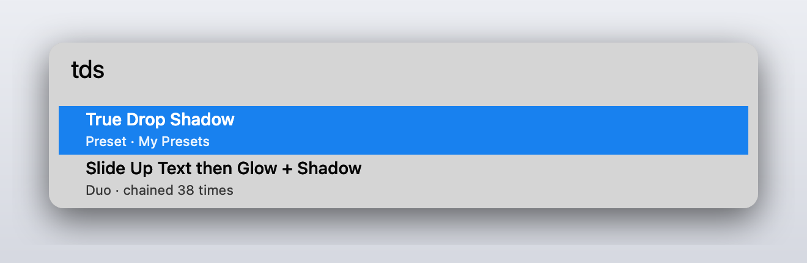
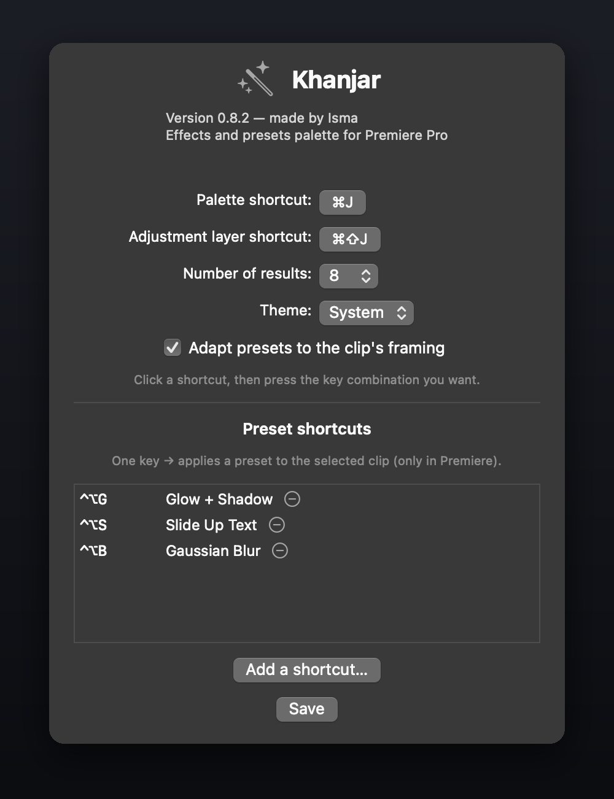
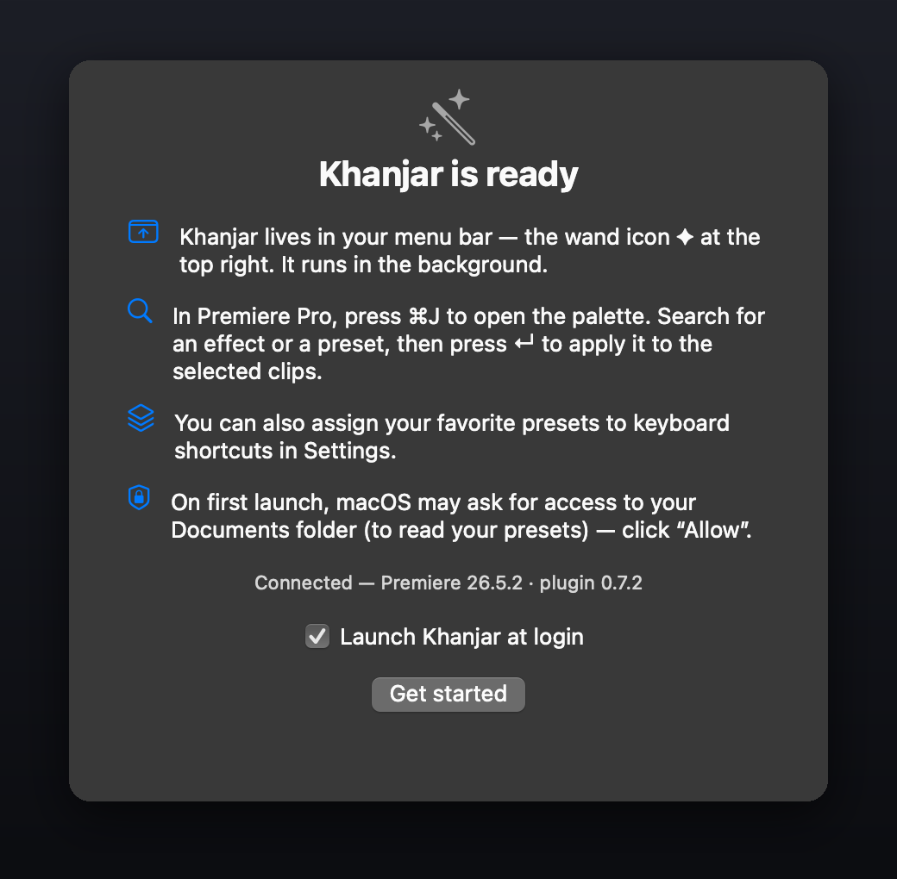
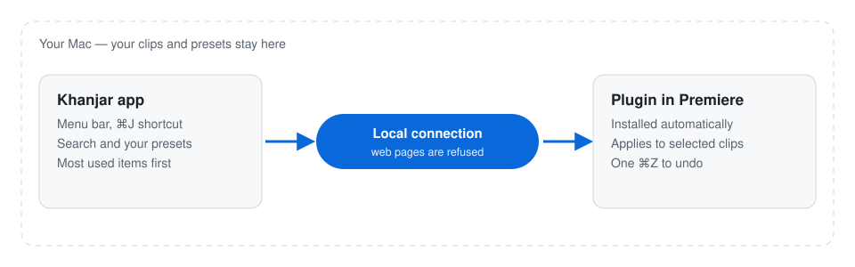

# Khanjar

**A Spotlight-style command palette for Adobe Premiere Pro on macOS.**
Press **⌘J**, type a few letters, hit **Enter**: the effect or preset is applied to every
selected clip, in a single undo step.

*Khanjar* (خنجر) means "dagger" in Arabic, Persian and Urdu.

> **Beta.** Free and open source. Not affiliated with or endorsed by Adobe.

<p align="center">
  
</p>

<p align="center"><a href="https://github.com/Apocale/khanjar/releases/latest"><b>Download the latest version</b></a> · <a href="docs/INSTALL.md">Install in 3 minutes</a> · <a href="docs/INSTALL.md#install-with-claude-code-easiest">Install with Claude Code</a> · <a href="docs/INSTALL.fr.md">En français</a></p>

## What it does

- **One search box for everything**: all video effects, your own presets and Adobe's presets.
  Fuzzy search, so `tds` finds *True Drop Shadow*.
- **Applies to many clips at once**: select 1 or 150 clips, one keystroke, one ⌘Z to undo.
- **Opens on what you actually use**: with an empty search box, the palette lists your most used
  items, ranked by frequency *and* recency. **⌘1 … ⌘0** apply them directly.
- **Duos**: when you always apply two presets one after the other, Khanjar offers them as a single
  item, stacked in the order you use.
- **Animated presets that look native**: keyframes are anchored like Premiere does (scaled, in-point
  or out-point anchored), and eased curves are reproduced frame by frame.
- **Your own shortcuts**: assign a key combination to any preset in Settings.
- **Adjustment layer at the playhead**: **⌘⇧J** drops an adjustment layer above your clips.
- **Automatic updates**, signed so that only genuine Khanjar releases can install.
- English and French interface.

## A closer look

**The palette opens on what you use most.** ⌘1 to ⌘0 apply an item without typing.
A *duo* (two presets you always chain) is one keystroke.

<picture>
  <source media="(prefers-color-scheme: dark)" srcset="docs/media/palette-frequent-dark.png">
  
</picture>

**Fuzzy search across effects and presets.** Type a word, or just the initials.

<table>
  <tr>
    <td><picture><source media="(prefers-color-scheme: dark)" srcset="docs/media/palette-search-dark.png"></picture></td>
    <td><picture><source media="(prefers-color-scheme: dark)" srcset="docs/media/palette-initials-dark.png"></picture></td>
  </tr>
  <tr><td align="center"><code>blur</code></td><td align="center"><code>tds</code> → True Drop Shadow</td></tr>
</table>

**A key for any preset, and a welcome screen that explains the rest.**

<table>
  <tr>
    <td></td>
    <td></td>
  </tr>
</table>

<sub>These screens are drawn by Khanjar itself (<code>khanjar render-media</code>) with example presets.</sub>

## Requirements

- A Mac with **Apple Silicon** (M1 or later).
- **Adobe Premiere Pro 2026** (version 26.x) and the **Creative Cloud** desktop app, which installs
  Khanjar's companion plugin inside Premiere.
- Tested on macOS 26 with Premiere Pro 26.5.

## Install

Easiest: paste the [Claude Code install prompt](docs/INSTALL.md#install-with-claude-code-easiest) ([en français](docs/INSTALL.fr.md#installer-avec-claude-code-le-plus-simple)).
Or download the latest `Khanjar.zip` from [Releases](../../releases), then follow the
[installation guide](docs/INSTALL.md) ([en français](docs/INSTALL.fr.md)).
The beta is not signed by Apple yet, so macOS asks you to confirm the first launch — the guide
shows how, in two clicks.

## Known limits

These come from what Adobe's plugin API allows today:

- Presets that rely on a **mask** shape, or on Lumetri **curves, color wheels or LUTs**, cannot be
  replayed faithfully, so they are left out of the palette rather than applied wrong. Lumetri presets
  that only move sliders (exposure, contrast, vignette…) work.
- A preset is marked *partial* when one of its effects no longer exists in your version of
  Premiere, or one of its settings cannot be set through Adobe's plugin API; the rest is applied.
- Khanjar **cannot create** an adjustment layer: create one once in your project
  (*File > New > Adjustment Layer*), Khanjar reuses it.
- Audio effects and transitions are not supported yet.

## Privacy

Khanjar runs entirely on your Mac. It talks to Premiere through a local connection
(`127.0.0.1`) that web pages are not allowed to use.

Two optional things use the internet: **update checks** (Khanjar asks you on its second launch;
it then reads the list of releases on GitHub) and **anonymous crash reports**, only if you tick
*Send anonymous crash reports* (off by default). It contains the versions and where in the code
the crash happened — never your clips, presets, projects, file paths or anything identifying you.
Details: [PRIVACY.md](PRIVACY.md).

## How it works

<picture>
  <source media="(prefers-color-scheme: dark)" srcset="docs/media/how-it-works-dark.svg">
  
</picture>

Two processes and a small protocol:

- **`helper/`** — the native Swift app (menu bar): global shortcut, palette window, search index,
  preset parsing (`.prfpset`), local WebSocket server.
- **`plugin/`** — a headless UXP plugin inside Premiere: a stateless executor that applies what the
  app asks for.

Details: [docs/ARCHITECTURE.md](docs/ARCHITECTURE.md) and [docs/PROTOCOL.md](docs/PROTOCOL.md).
Developer notes, including many hard-won findings about Premiere's API, are in
[AGENTS.md](AGENTS.md) (in French).

## Build from source

Requires the Xcode Command Line Tools (Swift 5.9 or later) and Python 3.

```bash
./scripts/build-app.sh        # builds dist/Khanjar.app with the plugin embedded
./scripts/fetch-sparkle.sh    # once, before a plain `swift build` (build-app.sh does it for you)
cd helper && swift build && ./.build/debug/khanjar selftest
```

Updates use [Sparkle](https://sparkle-project.org), downloaded and checksum-verified by
`scripts/fetch-sparkle.sh`. Releases are prepared by `scripts/release.sh`.

## FAQ

**Is there a Spotlight or command palette for Adobe Premiere Pro?**
Yes, that is what Khanjar is: press ⌘J in Premiere, type a few letters of any effect or preset,
press Enter.

**How do I apply an effect or a preset to many clips at once in Premiere Pro?**
Select the clips in the timeline, press ⌘J, pick the effect or preset. It lands on every selected
clip in one step, and one ⌘Z undoes it.

**Can I assign a keyboard shortcut to a preset in Premiere Pro?**
Yes: menu bar icon > *Settings…* > *Add a shortcut…*, choose the preset, press the key combination.

**How do I add an adjustment layer at the playhead with a shortcut?**
Press ⌘⇧J. Create one adjustment layer in your project once; Khanjar reuses it.

**Does it work with the preset packs I bought, or presets made in another language?**
Yes. Khanjar reads your own Premiere *Effect Presets* (where installed packs live) and Adobe's,
including presets saved in a Premiere set to another language. Third-party effects used by a pack
must be installed in your Premiere.

**Do animated presets keep their timing?**
Yes. Keyframes follow the preset's anchoring (stretched to the clip, or pinned to its start or end),
and eased curves are reproduced frame by frame.

**Is it free? Does it work on Windows or Intel Macs?**
Free and open source (GPL-3.0). macOS on Apple Silicon only for now.

**Does it slow Premiere down?**
No. An effect is applied in about 5 to 15 ms; Khanjar does nothing until you press a shortcut.

## En français

Khanjar est une palette gratuite pour Adobe Premiere Pro sur Mac : presse ⌘J, tape quelques
lettres d'un effet ou d'un preset, Entrée, et il s'applique à tous les clips sélectionnés. La palette
s'ouvre sur tes presets les plus utilisés, et tu peux mettre un raccourci clavier sur n'importe quel
preset. Interface en français. [Guide d'installation](docs/INSTALL.fr.md).

## Contributing

Bug reports and ideas are welcome: open an [issue](../../issues). See [CONTRIBUTING.md](CONTRIBUTING.md).

## License

[GPL-3.0](LICENSE) — made by Isma.
